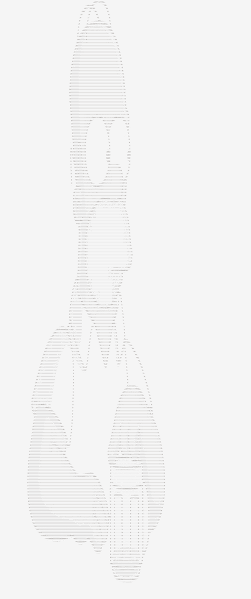

# ASCII Art

The idea of this project is to load images, translate them into ASCII ART images, optionally apply filters, and save them.

## Example run

After running `sbt run --image "examples/homer2.jpg" --brightness +10 --output-file "outputs/result.txt"`, [result](outputs/result.txt) looks like this:

